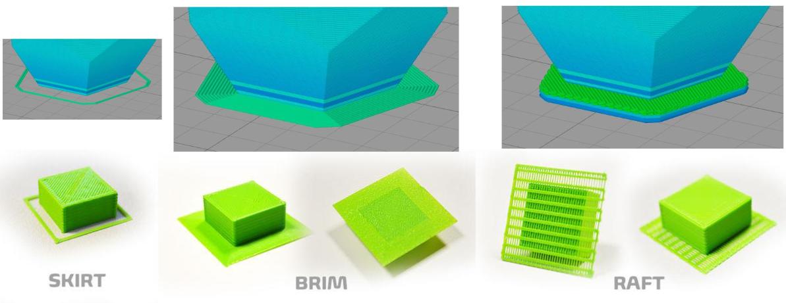

# Common 3D Printing Problems

## Adhesion Problems
The print doesn't stick to the bed

## Warping
E.g. the base of the print twist

## What can help
- Adjusting the heating of the bed
- Add a skirt, brim, or raft

