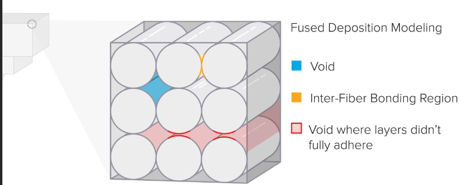

# Additive Manufacturing
A manufacturing process that adds material instead of removing it, as opposed to [[Subtractive Manufacturing]]

## Pros and Cons

### Pros
- Almost no waste material
- Allows us to produce incredibly complex parts 
  - Infeasible assemblies
  - Hollow parts
- Minimal [[Lead Time]] (in very low quantities):
  - perfect for prototypes
- Customization of parts

### Cons
- Not suitable for big quantities
- No efficient (time)
- More expensive than subtractive methods
- Can exhibit [[Anisotropic Behavior]]
- Less resistant than raw material (internal voids) (space between the internal honeycomb pattern)

